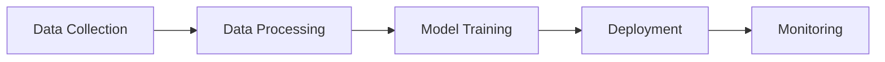
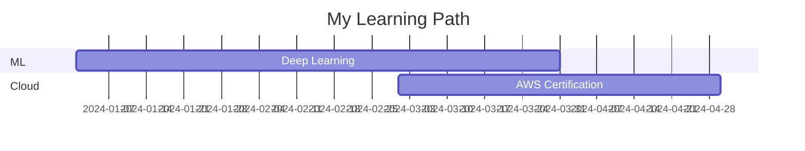

# 🎨 GitHub Profile README - Customization Guide

This guide will help you customize your new GitHub profile README to make it truly yours!

---

## 📋 Quick Start Checklist

### 1️⃣ **Replace Placeholder Information**

Search for and replace the following placeholders throughout `README.md`:

- `YOUR_GITHUB_USERNAME` → Your actual GitHub username
- `YOUR_LINKEDIN_URL` → Your LinkedIn profile URL
- `YOUR_EMAIL` → Your email address
- `YOUR_PORTFOLIO_URL` → Your portfolio website URL
- `YOUR_KAGGLE_URL` → Your Kaggle profile URL
- `YOUR_MEDIUM_URL` → Your Medium profile URL
- `YOUR_TWITTER_URL` → Your Twitter/X profile URL
- `YOUR_SPOTIFY_ID` → Your Spotify user ID (optional)

### 2️⃣ **Update Personal Information**

In the "About Me" section, update:
- `self.location = "Your Location"` → Your actual location
- Add or modify the interests list to match your focus areas
- Update the bullet points with your current projects and learning goals

### 3️⃣ **Customize Projects Section**

Replace the placeholder projects with your actual projects:
- Update `PROJECT_1` and `PROJECT_2` with your actual repository names
- Fill in the project descriptions with real details
- Add metrics, achievements, and tech stacks
- Include links to live demos or documentation

### 4️⃣ **Update Experience & Education**

- Fill in your work experience with company names and dates
- Add your actual achievements and metrics
- Update education section with your degree and university
- List your real certifications and awards

---

## 🎯 Advanced Customization

### 🎨 **Change Color Theme**

The README uses the "radical" theme. You can change it to other themes:

**Available themes:**
- `radical` (current - pink/purple)
- `tokyonight` (dark blue/purple)
- `dracula` (purple/pink)
- `monokai` (orange/green)
- `gruvbox` (retro brown/orange)
- `onedark` (dark with blue accents)
- `cobalt` (blue theme)
- `synthwave` (neon purple/pink)
- `highcontrast` (black/white)
- `github_dark` (GitHub's dark theme)

To change theme, replace `theme=radical` with your preferred theme in all widget URLs.

### 📊 **GitHub Stats Customization**

#### Show/Hide Stats
Add these parameters to the stats URL:
- `&hide=stars,commits,prs,issues` - Hide specific stats
- `&show_icons=true` - Show icons (already enabled)
- `&include_all_commits=true` - Count all commits (already enabled)
- `&count_private=true` - Count private repos (already enabled)

#### Custom Stats
```markdown

```

### 🏆 **Trophy Customization**

Customize trophy display:
- `&row=1` → Change to `&row=2` for 2 rows
- `&column=7` → Add to limit columns
- `&rank=SECRET,SSS,SS,S,AAA,AA,A,B,C` → Filter by rank

### 📈 **Activity Graph Options**

Customize the contribution graph colors:
```markdown
&bg_color=1a1b27&color=00d9ff&line=00d9ff&point=ffffff
```
- `bg_color` - Background color
- `color` - Graph color
- `line` - Line color
- `point` - Point color

### 🎵 **Spotify Integration (Optional)**

To add Spotify now playing:
1. Go to [Spotify Developer Dashboard](https://developer.spotify.com/dashboard)
2. Create an app to get your Spotify ID
3. Follow [this guide](https://github.com/kittinan/spotify-github-profile) for setup
4. Replace `YOUR_SPOTIFY_ID` with your actual Spotify user ID

If you don't want Spotify, remove this section from README.

### ⏰ **WakaTime Integration (Optional)**

To show coding activity:
1. Sign up at [WakaTime](https://wakatime.com/)
2. Install WakaTime plugin in your IDE
3. Follow [waka-readme-stats](https://github.com/anmol098/waka-readme-stats) setup
4. The stats will auto-populate between the comments:
   ```markdown
   <!--START_SECTION:waka-->
   <!--END_SECTION:waka-->
   ```

---

## 🖼️ **Banner Customization**

### Option 1: Use the Generated Banner
The custom banner `profile-banner.png` has been created for you. It's already referenced in the README.

### Option 2: Create Your Own Banner
1. Use tools like:
   - [Canva](https://www.canva.com/) - Easy drag-and-drop
   - [Figma](https://www.figma.com/) - Professional design
   - Photoshop/GIMP - Advanced editing
   - AI tools like Midjourney or DALL-E

2. Recommended dimensions: **1280x320px** or **1200x300px**

3. Save as `profile-banner.png` in your profile repository

### Option 3: Use Capsule Render
Replace the banner with a dynamic header:
```markdown

```

Customize parameters:
- `type` - wave, waving, cylinder, rounded, shark, etc.
- `color` - gradient, timeGradient, or hex color
- `text` - Your name
- `desc` - Your title

---

## 🎨 **Badge Customization**

### Add More Badges
Visit [Shields.io](https://shields.io/) or [Simple Badges](https://badges.pages.dev/) to create custom badges.

**Template:**
```markdown

```

**Popular tech badges:**
```markdown


```

### Change Badge Style
Replace `style=for-the-badge` with:
- `style=flat` - Flat style
- `style=flat-square` - Flat with square edges
- `style=plastic` - Plastic style
- `style=social` - Social media style

---

## 📊 **Widget Alternatives**

### GitHub Stats Alternatives

**1. GitHub Profile Summary Cards**
```markdown

```

**2. GitHub Metrics**
More advanced, requires setup: [lowlighter/metrics](https://github.com/lowlighter/metrics)

**3. 3D Contribution Graph**
```markdown

```
Setup: [yoshi389111/github-profile-3d-contrib](https://github.com/yoshi389111/github-profile-3d-contrib)

---

## 🎯 **Mermaid Diagram Customization**

The README includes a mindmap. You can customize it or use other diagram types:

### Flowchart Example


### Gantt Chart Example


Visit [Mermaid Live Editor](https://mermaid.live/) to create custom diagrams.

---

## 🚀 **Performance Tips**

1. **Optimize Images**: Keep banner under 1MB for fast loading
2. **Cache Widgets**: GitHub caches widget images, updates may take a few minutes
3. **Test Locally**: Preview your README before committing
4. **Mobile-Friendly**: Test how it looks on mobile devices

---

## 🔧 **Troubleshooting**

### Stats Not Showing?
- Verify your username is correct
- Check if your profile is public
- Wait a few minutes for cache to clear
- Try incognito mode to see fresh version

### Broken Images?
- Ensure image paths are correct
- Check if external services are online
- Verify image URLs are accessible

### Widgets Not Updating?
- GitHub caches images for ~2 hours
- Force refresh with Ctrl+F5 (Windows) or Cmd+Shift+R (Mac)
- Check service status at [Vercel Status](https://www.vercel-status.com/)

---

## 📚 **Resources**

### Inspiration
- [Awesome GitHub Profile README](https://github.com/abhisheknaiidu/awesome-github-profile-readme)
- [GitHub Profile README Generator](https://rahuldkjain.github.io/gh-profile-readme-generator/)
- [Profile README Examples](https://github.com/topics/profile-readme)

### Tools & Services
- [GitHub Readme Stats](https://github.com/anuraghazra/github-readme-stats)
- [GitHub Readme Streak Stats](https://github.com/DenverCoder1/github-readme-streak-stats)
- [Typing SVG](https://github.com/DenverCoder1/readme-typing-svg)
- [Shields.io](https://shields.io/) - Badge generator
- [Capsule Render](https://github.com/kyechan99/capsule-render) - Dynamic headers

### Learning
- [Markdown Guide](https://www.markdownguide.org/)
- [GitHub Flavored Markdown](https://github.github.com/gfm/)
- [Mermaid Documentation](https://mermaid.js.org/)

---

## ✨ **Final Steps**

1. **Create GitHub Profile Repository**
   - Create a repository with the same name as your GitHub username
   - Make it public
   - Add the `README.md` file
   - Upload the `profile-banner.png` image

2. **Test Everything**
   - Check all links work
   - Verify images load
   - Test on mobile
   - Ask friends for feedback

3. **Keep It Updated**
   - Update projects regularly
   - Add new skills as you learn
   - Refresh achievements
   - Keep stats current

4. **Share It!**
   - Add to your LinkedIn
   - Share on Twitter/X
   - Include in job applications
   - Show it off! 🎉

---

## 🎨 **Pro Tips**

- **Consistency**: Use consistent emoji and formatting throughout
- **Brevity**: Keep descriptions concise and impactful
- **Visual Balance**: Don't overcrowd with too many widgets
- **Personal Touch**: Add your personality and unique style
- **Regular Updates**: Keep your profile fresh and current
- **Call to Action**: Make it easy for people to connect with you

---

**Need help?** Feel free to reach out or check the resources above!

**Happy customizing! 🚀**
