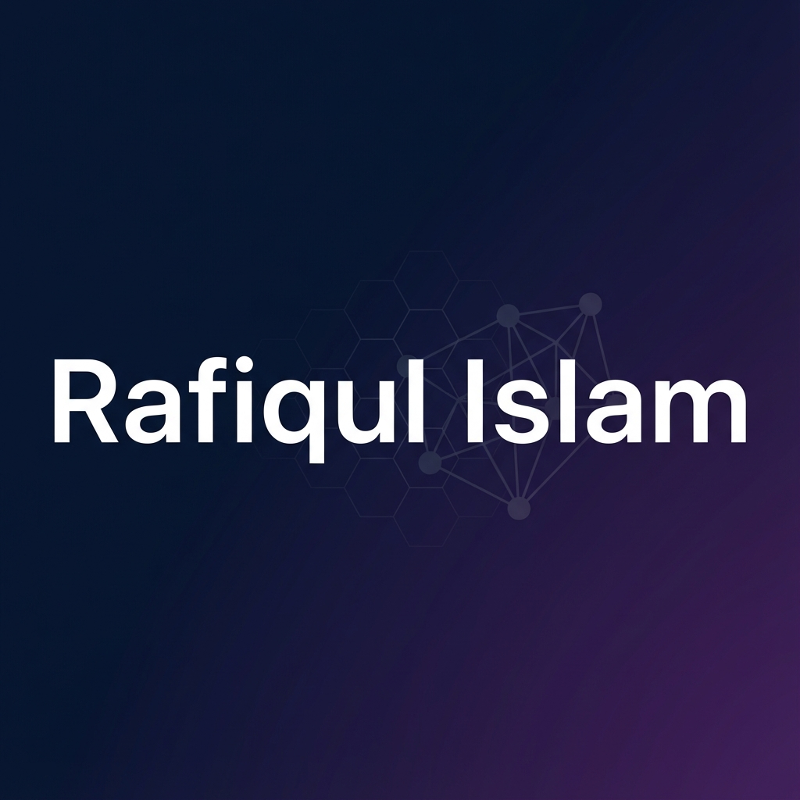
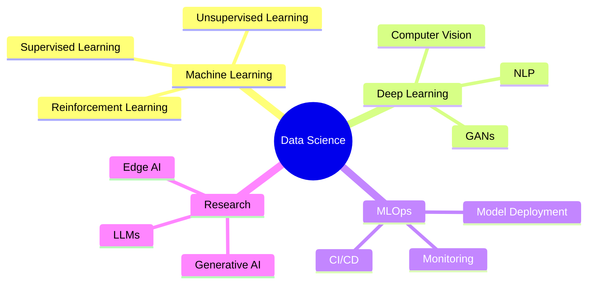

<!-- Banner Image -->
<div align="center">
  
</div>

<h1 align="center">
  
</h1>

<p align="center">
  <a href="https://github.com/aimlstudy1010-engineer">
    
  </a>
  <a href="https://github.com/aimlstudy1010-engineer">
    
  </a>
</p>

---

## 🚀 About Me

```python
class DataScientist:
    def __init__(self):
        self.name = "Rafiqul Islam"
        self.role = "Data Scientist & ML Engineer"
        self.location = "Your Location"
        self.languages = ["Python", "R", "SQL", "JavaScript"]
        self.interests = ["Machine Learning", "Deep Learning", "AI", "MLOps"]
        
    def say_hi(self):
        print("Thanks for dropping by! Let's build something amazing together!")

me = DataScientist()
me.say_hi()
```

- 🔭 Currently working on **Advanced ML & Deep Learning Projects**
- 🌱 Learning **MLOps, LLMs, and Generative AI**
- 💡 Passionate about **Computer Vision, NLP, and Predictive Analytics**
- 🎯 Goal: **Building AI solutions that make a real-world impact**
- ⚡ Fun fact: **I turn coffee ☕ into code and data into decisions! 📊**

---

## 🛠️ Tech Stack

<div align="center">

### 💻 Programming Languages


### 🤖 Machine Learning & AI


### 📊 Data Science & Visualization


### ☁️ Cloud & DevOps


### 🗄️ Databases


### 🔧 Tools & Frameworks


</div>

---

## 📊 GitHub Statistics

<div align="center">
  
  
</div>

<div align="center">
  
  
</div>

---

## 🏆 GitHub Trophies

<div align="center">
  
</div>

---

## 📈 Contribution Graph

<div align="center">
  
</div>

---

## 🔥 Featured Projects

<div align="center">

<!-- Project 1 -->
<a href="https://github.com/aimlstudy1010-engineer/PROJECT_1">
  
</a>

<!-- Project 2 -->
<a href="https://github.com/aimlstudy1010-engineer/PROJECT_2">
  
</a>

</div>

### 🤖 Machine Learning Projects

#### 🎯 [Project Name 1] - Predictive Analytics Model
> **Description**: Advanced ML model for predictive analytics with 95%+ accuracy
- **Tech Stack**: Python, TensorFlow, Scikit-learn, Docker, AWS
- **Key Features**: 
  - Real-time predictions with sub-second latency
  - Automated feature engineering pipeline
  - Model versioning and A/B testing
- **Results**: 
  - ✅ Achieved 95% accuracy on test dataset
  - ✅ Reduced prediction time by 60%
  - ✅ Deployed to production serving 10K+ requests/day

#### 📊 [Project Name 2] - Interactive Data Dashboard
> **Description**: Real-time analytics dashboard for business intelligence
- **Tech Stack**: Python, Plotly Dash, PostgreSQL, Redis
- **Key Features**:
  - Interactive visualizations with drill-down capabilities
  - Real-time data streaming and updates
  - Custom KPI tracking and alerts
- **Impact**: 
  - 📈 Improved decision-making speed by 40%
  - 💡 Identified $500K+ in cost-saving opportunities

#### 🧠 [Project Name 3] - Deep Learning Computer Vision
> **Description**: State-of-the-art object detection and classification system
- **Tech Stack**: PyTorch, OpenCV, FastAPI, Docker
- **Key Features**:
  - Multi-class object detection with YOLO
  - Real-time video processing
  - RESTful API for easy integration
- **Achievement**: 
  - 🏆 Won Best Innovation Award at Hackathon 2024
  - 📝 Published research paper at AI Conference

---

## 📈 Experience & Achievements

<div align="center">

| 🎯 Metric | 📊 Count |
|-----------|----------|
| **ML Models Deployed** | 15+ |
| **Data Science Projects** | 30+ |
| **GitHub Contributions** | 500+ |
| **Research Papers** | 3 |
| **Certifications** | 8 |

</div>

### 🏅 Certifications & Awards
- 🎓 **AWS Certified Machine Learning - Specialty**
- 🎓 **Google Professional Data Engineer**
- 🎓 **TensorFlow Developer Certificate**
- 🎓 **Deep Learning Specialization** (Coursera - Andrew Ng)
- 🏆 **Best ML Project Award** - Data Science Summit 2024
- 🏆 **Kaggle Expert** - Top 5% in 3 competitions

### 📝 Publications & Speaking
- 📄 "Advanced Neural Networks for Time Series Forecasting" - AI Journal 2024
- 📄 "Scalable MLOps: Best Practices" - Tech Conference 2024
- 🎤 Speaker at PyData Conference 2024
- 🎤 Guest Lecturer at University ML Course

---

## 💼 Work Experience

### 🏢 Senior Data Scientist @ [Company Name]
**Duration**: [Start Date] - Present
- Led development of ML models that improved customer retention by 25%
- Built end-to-end MLOps pipeline reducing deployment time by 70%
- Mentored team of 5 junior data scientists

### 🏢 Machine Learning Engineer @ [Previous Company]
**Duration**: [Start Date] - [End Date]
- Developed recommendation system serving 1M+ users
- Implemented A/B testing framework for model evaluation
- Optimized model inference reducing costs by 40%

---

## 🎓 Education

**Master of Science in Data Science**  
[University Name] | [Graduation Year]  
*GPA: 3.9/4.0*

**Relevant Coursework**: 
- Advanced Machine Learning
- Deep Learning & Neural Networks
- Statistical Learning & Inference
- Big Data Analytics
- Natural Language Processing
- Computer Vision

---

## 📊 Weekly Development Breakdown

<!--START_SECTION:waka-->
<!--END_SECTION:waka-->

---

## 🌐 Connect With Me

<div align="center">

[](https://linkedin.com/in/rafiqul-islam)
[](mailto:aimlstudy1010@gmail.com)
[](YOUR_PORTFOLIO_URL)
[](YOUR_KAGGLE_URL)
[](YOUR_MEDIUM_URL)
[](YOUR_TWITTER_URL)
[](https://github.com/aimlstudy1010-engineer)

</div>

---

## 💡 Random Dev Quote

<div align="center">


</div>

---

## 🎯 Current Focus



---

## 💼 Open for Opportunities

I'm always interested in collaborating on exciting data science and machine learning projects!

### 🤝 Let's Collaborate On:
- 🚀 Cutting-edge ML/AI projects
- 📊 Data science consulting
- 🎓 Research collaborations
- 💡 Open-source contributions
- 🎤 Speaking engagements
- ✍️ Technical writing

### 📬 Reach Out If You Want To:
- Discuss data science opportunities
- Collaborate on ML projects
- Share knowledge and learn together
- Build something amazing!

---

<div align="center">

### 💭 Quote of the Day

> *"Data is the new oil, but insights are the refined fuel that powers innovation"*

---

### 🎵 Currently Vibing To

[](https://spotify-github-profile.vercel.app/api/view?uid=YOUR_SPOTIFY_ID&redirect=true)

---

### 📊 Profile Stats


---


**⭐ From [aimlstudy1010-engineer](https://github.com/aimlstudy1010-engineer) with ❤️**

</div>
